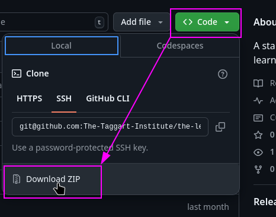

# 0-2: Materials

You won't need much for this course other than the device you're currently using to take it. Ideally, that device has a keyboard you like typing on. You may also want a physical notebook, if you enjoy taking notes like that.

Otherwise, you'll want to install [Obsidian](https://obsidian.md). It's a powerful note-taking app that this course uses as a primary tool. Nothing we cover in this course is impossible without Obsidian, but the course repository itself is designed as an Obsidian **Vault** to get you started on the right foot with planning and note-taking.

This course's [GitHub repository](https://github.com/The-Taggart-Institute/the-learning-journey) serves as a starting Vault for you, complete with a set of useful plugins. You can **clone** the repository, if you know how, or you can use the Download button to download a zipped copy directly.

There are two other things you'll need, but they aren't strictly "materials." We'll talk about it in the next section.