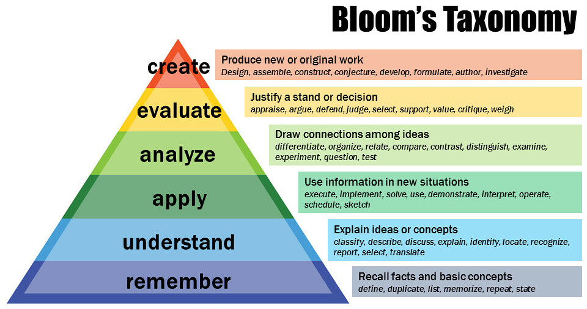

# 1-2: Bloom's Taxonomy

_By Vanderbilt University Center for Teaching - https://www.flickr.com/photos/vandycft/29428436431, CC BY 2.0, https://commons.wikimedia.org/w/index.php?curid=96306577_

Here's our first bit of education theory! I promise to keep it light. 

Benjamin Bloom's taxonomy of learning is a very useful model for breaking down the different levels of learning. Think of it like the [OSI Model](https://en.wikipedia.org/wiki/OSI_model), but for your brain! And like the OSI model, it is _symbolic_, and not intended to accurately represent how your brain processes information. Still, each echelon of the taxonomy describes a usefully distinct part of the learning process. Let's quickly go through them.

## Remember

Retaining basic information is the first rung on the learning ladder, but far from the last. Although school systems have focused on rote memorization for centuries, we can and should go much further. In fact, the usefulness of memorization is vastly diminished in the information age, in which factual information is at our fingertips (at least for now).  Nevertheless, it's handy to have basic facts at the ready. For example, knowing how many bits are in a byte, and how many bytes make up a megabyte can make the skills built on those facts easier to learn.

I'll also note here that knowing _where_ to find information is still a kind of remembering, and this **transactional memory** is more important than ever. Even if you can't remember a fact, knowing where to find it is the next best thing. Actually, sometimes it's even better if the fact comes with more context.

## Understand

Can you explain a concept in your own words? Then you've achieved this echelon. Explaining is the ultimate test, since it forces you to order the ideas into a cohesive narrative (there's that word again...).

This echelon also demonstrates why, even when self-directing your learning, complete isolation is a bad idea. More on this in the next section.

## Apply

Okay, you can explain a concept. Can you use it? As an example, can you write a simple program in the language you're studying? Looking at documentation is fine, but solving problems with the knowledge in question demonstrates you've achieved this echelon.

## Analyze

This is where you start to truly own the knowledge. Can you think critically about the topic, finding connections to related concepts, and discover similarities/differences? Can you independently ask and answer questions about the topic? 

## Evaluate

In truth, I think this one is pretty much the same as the last. However, for the sake of the model, this is about standing up to scrutiny. When someone questions a claim, can you back up your position with reasoning based on facts? Can you make decisions that require knowledge in the area of study for optimal outcomes? 

## Create/Contribute

Can you make something new with this knowledge? I added "Contribute" here because I believe that many skills present themselves at this echelon in collaborative endeavors—think of open source software. Either way, your mastery of a topic allow you to create something that hasn't existed before. Something that works. The ability to create is the ultimate exhibition of mastery—a term we'll be revisiting later.

## One Model, not _The_ Model

Remember that as useful as Bloom's Taxonomy is, it is only one metaphor for the learning process. There are others, and you may your experience does not align with this construction. That is perfectly fine! Mostly I want you to be mindful that there _are_ differing levels of skill and concept mastery, and that you should be testing yourself as you go to determine exactly where you are in your journey.

