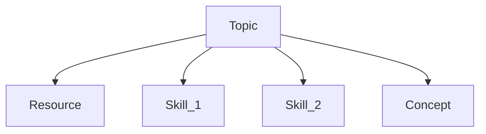

# 2-3: The Study Map

While the Learning Plan is a critical element, it is text-first as a tool. Not everyone thinks that way, and sometimes a visual representation of your journey can be beneficial. That's what the Study Map is all about: taking the Learning Plan and creating visual relationships between its components.

The Study Map is a big part of why I had you install Obsidian in the first place. Although you certainly don't have to use the tools available here to make your Study Map, I think between all the options, you'll find something that works for you. 
## Purpose

Study Maps provide two purposes: a way to visualize your Learning Plan (in whatever shape you've made one), and a way of marking progress and recording discoveries along the way. The specific form is less important than the practice. But the form is worth exploring for a moment.

## Map Creation Options

Some people organize ideas in lists. Others tend toward visual diagrams or maps. I'll admit, I lean toward the former, but I recognize the value in visual relationships between topics or concepts. That's why Obsidian is such a useful tool. It gives you several ways to build your learning plan, ranging from text-forward to very visual. Let's explore them, starting with the built-in Canvas feature.
### Canvas

Obsidian Canvas—[an open source standard](https://jsoncanvas.org), by the way—allows you to visually organize Markdown documents on a single, infinite, 2-dimensional space. By making "nodes" in a map out of Markdown documents, either embedded in the Canvas or directly from the Vault, Canvas splits the difference between text and visual organization.

In our sample Study Map made with Canvas, I've created two Learning Plans that are somewhat related. The relationships are made clear, and a couple of individual skill goals are broken out into separate items for easier tracking.

You can edit individual files right from the Canvas, as well as make smaller items without making new documents. You can create groups and relationships as well. It isn't the most advanced mind mapping tool, but it is _just enough_ mind mapping to be useful without getting in its own way.

Have a look at the example Study Map Canvas to see how you might organize your Map.

### Excalidraw

I've installed a plugin in this Vault that takes advantage of my favorite mind mapping/diagramming tools: Excalidraw. This simple tool allows quick diagram/flowchart creation in a very graphical format. The Obsidian version of this tool allows you to embed Excalidraw diagrams into Obsidian notes.

Making a Study Map with Excalidraw may appeal to you if you're more visual than text-oriented. 

Here's an example of an Excalidraw Study Map:

![[Study-Map.excalidraw]]

It's not as detailed as the Canvas one—that could be a benefit or drawback, depending on your organization style. But the creation is quick and easy, which may be more important to you. Use the tool that works for you!

### Mermaid

I'm including this one mainly because I think it's cool that it works at all, not because I really think it's a good idea. But hey, if it works for you, rock on.

Obsidian supports [Mermaid](https://mermaid.js.org), a markup language for defining graphical diagrams in plaintext. By placing Mermaid syntax into an appropriately labeled code block, you can render the diagram directly in Obsidian! Check it out:

There's quite a lot to Mermaid syntax, and I'll admit I'm no expert with it. But if you insist that all your diagrams be represented as pure plaintext, this may be an option for you. I've included the Mermaid Tools plugin for this Vault, which provides starting snippets for many kinds of Mermaid diagrams.

Remember, these are all just suggestions. The most important rule for a tool, whether in study or practice, is to **use what works until it doesn't**. Don't get trapped in the search for the ultimate tool. Good enough is good enough. If you have a Study Map that points your in your direction and helps keep you accountable, you're well on your way.