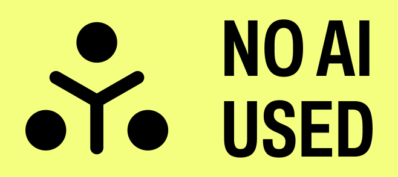

# The Learning Journey

Do you want to learn something outside of a traditional classroom setting? Do have questions about how to do it well, how to do it successfully? Are you crazy busy with other obligations, and have no idea how you'll make it all work?

You're in the right place.

I've been teaching students of all ages for the better part of 20 years now, both in classrooms and remotely. I've been a self-directed learner for longer than that. Combining these histories, I've put together a set of tools, a little education theory, and some simple methods for success in self-directed learning. With these, I hope you'll find success and fulfillment in the journey.

## AI-Free Disclaimer

## Copyright

Although this repository is open source and suggestions in the form of Pull Requests are welcome, this remains the intellectual property of The Taggart Institute, LLC, under the following license:

This work is licensed under a <a rel="license" href="http://creativecommons.org/licenses/by-nc-nd/4.0/">Creative Commons Attribution-NonCommercial-NoDerivatives 4.0 International License</a>.

## Course Overview

This course provides a set of recommendations and tools for effective self-directed learning. Learning as an adult, on your own time, and balanced with other responsibilities, is an entirely different undertaking than learning in formal school. This course clarifies how adult learning works, and how to do it well.

We break down our **learning objectives** between **skills** and **concepts**.

### Skills

By the end of this course, the learner should be able to:

- Use Obsidian for note-taking and planning
- Recognize the various levels of learning
- Create a Learning Plan and Study Map to guide their journey
- Effectively evaluate learning/information resources for quality and appropriateness
- Self-assess learning via metacognition 
- Create Exhibitions of Mastery to demonstrate success

### Concepts

By the end of this course, the learner should understand:

- TTI's Four Tenets of Adult Learning
- Basic education theory concepts, including:
	- Bloom's Taxonomy
	- Theory of Margin
	- Zone of Proximal Development
	- Cognitive Load Theory
	- Constructivism
	- Behaviorism
- The dangers of LLMs

## Prerequisites

None. This is the starting point for all TTI courses.

## The TTI Community

Discussion and support for this course takes place on [The Taggart Institute Discord](https://discord.gg/taggartinstitute). Please consider joining the community of learners there!

